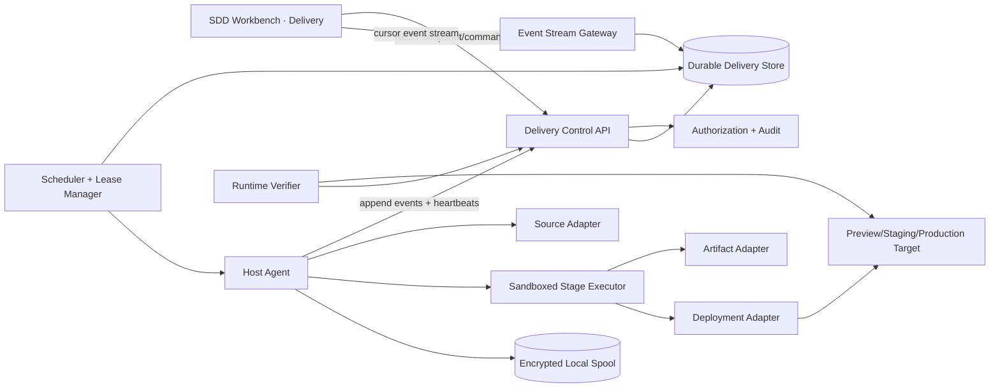

# CI/CD ejecutado en hosts y observabilidad de Delivery dentro de SDD Workbench

## 1. Propósito del documento

Esta propuesta define una plataforma reusable para ejecutar CI y CD en infraestructura controlada por el usuario y observar todo el proceso desde una superficie `Delivery` integrada en SDD Workbench.

El documento es deliberadamente independiente del repositorio donde se aloja. No presupone un producto, lenguaje, proveedor de Git, nube, framework de frontend ni destino de deployment específicos. Puede extraerse como un paquete compuesto por este `spec.md`, [plan.md](plan.md) y [tasks.md](tasks.md).

Este documento no autoriza una implementación, un deployment ni una publicación productiva. Tampoco registra un spec en ningún índice SDD.

## 2. Problema

Cuando la validación y el deployment se ejecutan desde un host propio, su estado suele quedar fragmentado entre procesos, archivos temporales, `systemd`, logs, herramientas de Git y consolas de proveedores. Esa fragmentación produce varios problemas:

- la persona responsable depende de un operador para saber si algo sigue ejecutándose;
- CI verde, deployment exitoso y runtime saludable pueden confundirse aunque sean hechos distintos;
- no existe una vista confiable del SHA solicitado, validado, construido, desplegado y verificado;
- un proceso puede fallar antes de tocar el runtime, pero la UI no distingue ese caso de un rollback;
- los logs pueden exponer secretos si se transmiten sin sanitización;
- los reinicios del host o la pérdida de conexión pueden dejar ejecuciones huérfanas;
- múltiples commits pueden producir carreras, trabajo obsoleto o despliegues del SHA incorrecto;
- la medición de recursos puede ser engañosa, por ejemplo mostrando `113 % CPU` sin explicar que equivale a `1,13 cores`;
- los repositorios privados pueden parecer inexistentes si se consulta GitHub sin autenticación.

## 3. Resultado esperado

Una persona abre SDD Workbench y puede responder, sin usar una terminal:

1. ¿Cuál es el último commit conocido del branch objetivo?
2. ¿Qué commit está validando CI y qué commit está publicado?
3. ¿En qué etapa está la ejecución y cuánto tiempo lleva?
4. ¿El runtime fue modificado o el fallo ocurrió antes?
5. ¿Hubo canary, rollback o verificación pública?
6. ¿Qué host ejecuta el trabajo y cuántos recursos consume?
7. ¿Qué evidencia, artefactos y logs sanitizados existen?
8. ¿Qué acción segura puede realizarse a continuación?

La plataforma ejecuta CI/CD sin consumir runners del proveedor Git. Git continúa siendo la fuente de código e identidad del commit; Workbench es el plano de observabilidad y control; los hosts registrados son el plano de ejecución.

## 4. Principios no negociables

### 4.1 Fuente de verdad explícita

- Git define el contenido del commit.
- El almacén durable de Delivery conserva ejecuciones, eventos y proyecciones.
- El runtime se considera publicado sólo cuando una attestation remota confirma SHA y/o digest.
- Un archivo de estado local es un buffer operativo, no la única fuente de verdad.

### 4.2 Invariantes de identidad

- Una ejecución se fija a un SHA completo e inmutable.
- Todos los artefactos construidos deben declarar el mismo SHA y sus digests.
- El SHA validado, construido, desplegado y verificado se muestra por separado.
- Si el branch avanza, una política explícita decide entre continuar, cancelar o marcar la ejecución como `superseded`; nunca se cambia el objetivo silenciosamente.

### 4.3 Separación de estados

La plataforma no comprimirá todo en un único “verde” o “rojo”. Mantendrá, como mínimo:

- estado de fuente y autenticación Git;
- estado de CI;
- estado de construcción de artefactos;
- estado de deployment;
- estado de rollback;
- estado de smoke/aceptación técnica;
- estado observado del runtime;
- estado de UAT humano.

### 4.4 Build once, promote by identity

Un artefacto validado se promueve por digest cuando el destino lo permite. Si un adaptador exige reconstrucción, debe producir nueva procedencia y volver a validar identidad; no puede presentarse como el mismo artefacto.

### 4.5 Ejecución segura por defecto

- La UI comienza en modo observación.
- Las acciones mutables requieren autorización backend, idempotency key y auditoría.
- La UI nunca envía comandos shell arbitrarios.
- Los pasos ejecutables provienen de definiciones versionadas y allowlists.
- Los secretos se resuelven en el host sólo durante la etapa autorizada.
- Ningún secreto, entorno completo o token se persiste en eventos o logs visibles.

### 4.6 Evidencia antes que optimismo

- “CI verde” requiere todos los gates obligatorios satisfechos para el SHA exacto.
- “Desplegado” requiere que el adaptador de destino confirme la operación.
- “Disponible” requiere health/readiness y attestation externa.
- “UAT aprobado” sólo puede provenir de una decisión humana registrada.

### 4.7 Portabilidad mediante adaptadores

El dominio central no conoce GitHub Actions, Cloudflare, Kubernetes, Docker, `systemd` ni un framework de UI. Esos sistemas se integran mediante puertos versionados.

## 5. Alcance

### 5.1 Incluido

- registro y heartbeat de uno o más agentes de ejecución;
- checkout aislado de un SHA exacto;
- pipelines locales declarativas con etapas, dependencias y gates;
- validaciones, tests, builds, backups, migraciones, canary, switch, publicación, smoke y rollback;
- persistencia durable y append-only de eventos;
- snapshots consultables y streaming en tiempo real;
- historial, filtros, logs sanitizados, evidencia y artefactos referenciados;
- telemetría de CPU, memoria, disco, red y presión de cola;
- integración autenticada con repositorios privados;
- vista `Delivery` dentro de SDD Workbench en mobile, tablet y desktop;
- acciones permissionadas de cancelación, retry, redeploy y rollback;
- extensiones para múltiples proyectos, hosts y destinos.

### 5.2 Fuera de alcance inicial

- reemplazar Git como fuente de código;
- editar pipelines con un diseñador visual;
- ejecutar comandos arbitrarios desde el navegador;
- almacenar secretos en Workbench;
- declarar producción habilitada por defecto;
- inventar políticas de aprobación, retención o migración para un producto concreto;
- sustituir observabilidad del runtime de propósito general;
- considerar una preview como aceptación productiva.

## 6. Actores y responsabilidades

| Actor | Responsabilidad |
| --- | --- |
| Responsable/UAT | Observa, abre la preview y registra una decisión humana. |
| Developer o agente | Produce commits y evidencia; no altera estados de runtime manualmente. |
| Workbench backend | Autoriza, persiste, proyecta, transmite y audita. |
| Scheduler | Selecciona host, aplica concurrencia y crea leases. |
| Host agent | Ejecuta definiciones permitidas, emite eventos y protege secretos. |
| Source adapter | Resuelve branches, commits y metadata con autenticación. |
| Artifact adapter | Construye, verifica y referencia artefactos inmutables. |
| Deployment adapter | Aplica, inspecciona y revierte un destino específico. |
| Runtime verifier | Comprueba health, readiness, SHA/digest y smoke externo. |

## 7. Arquitectura propuesta



### 7.1 Plano de control

Mantiene definiciones, runs, permisos, leases, comandos, auditoría y proyecciones. No necesita acceso directo a secretos de deployment.

### 7.2 Plano de ejecución

Cada host agent:

- anuncia capacidades y etiquetas;
- obtiene un lease con vencimiento;
- materializa un workspace aislado;
- resuelve secretos por referencia;
- ejecuta etapas permitidas con límites de recursos;
- sanitiza antes de persistir o transmitir;
- conserva un spool local si el backend queda temporalmente inaccesible;
- recupera o declara huérfana una ejecución tras reinicio.

### 7.3 Plano de datos

Usa un almacén relacional durable para identidades, estados y eventos, y un almacén de objetos o chunks para logs y artefactos grandes. Los eventos son append-only; las vistas de UI son proyecciones reconstruibles.

### 7.4 Plano de presentación

Workbench consume un contrato estable de snapshots y eventos. No interpreta directamente archivos de `systemd`, Docker, GitHub o proveedores cloud.

## 8. Definición portable de pipeline

Las pipelines se versionan junto al código o en un catálogo confiable. El formato exacto queda sujeto a un ADR, pero debe expresar:

```yaml
apiVersion: workbench.delivery/v1alpha1
kind: Pipeline
metadata:
  name: preview
spec:
  source:
    branch: main
    supersessionPolicy: cancel_before_mutation
  concurrency:
    group: "${workspace}:preview"
    limit: 1
  stages:
    - id: source
      uses: source.checkout
    - id: validate
      needs: [source]
      uses: command.group
      mutationBoundary: none
    - id: build
      needs: [validate]
      uses: artifact.build
    - id: backup
      needs: [build]
      uses: database.backup
      mutationBoundary: reversible
    - id: migrate
      needs: [backup]
      uses: database.migrate
      retryPolicy: never_automatic
    - id: canary
      needs: [migrate]
      uses: runtime.canary
    - id: deploy
      needs: [canary]
      uses: deployment.apply
    - id: verify
      needs: [deploy]
      uses: runtime.verify
    - id: rollback
      needs: [deploy]
      when: failure_after_mutation
      uses: deployment.rollback
```

Cada etapa declara timeout, precondiciones, mutabilidad, retry permitido, evidencia esperada y política de cancelación. No se aplican reintentos automáticos a migraciones, publicación o pasos no idempotentes salvo contrato explícito.

## 9. Modelo de dominio

### 9.1 Entidades principales

| Entidad | Campos esenciales |
| --- | --- |
| `Workspace` | `id`, `displayName`, `sourceBinding`, `deliveryPolicyRef` |
| `PipelineDefinition` | `id`, `version`, `contentDigest`, `stages`, `policyRefs` |
| `PipelineRun` | `id`, `workspaceId`, `pipelineVersion`, `targetSha`, `trigger`, `status`, `createdAt` |
| `StageRun` | `id`, `runId`, `stageId`, `attempt`, `status`, `mutationBoundary`, timestamps |
| `RunEvent` | `eventId`, `runId`, `sequence`, `type`, `schemaVersion`, `payload`, `occurredAt` |
| `Agent` | `id`, `labels`, `capabilities`, `version`, `heartbeatAt`, `status` |
| `Lease` | `id`, `runId`, `agentId`, `expiresAt`, `fencingToken` |
| `ArtifactRef` | `kind`, `digest`, `revision`, `source`, `metadata`, `retention` |
| `DeploymentRecord` | `environment`, `artifactRefs`, `targetSha`, `providerRef`, `status` |
| `RuntimeAttestation` | `observedSha`, `artifactDigests`, `health`, `readiness`, `observedAt` |
| `ResourceSample` | `agentId`, `runId`, CPU cores, host %, memory, disk, load, timestamp |
| `CommandRequest` | `kind`, `actor`, `reason`, `idempotencyKey`, `decision`, `createdAt` |
| `UatDecision` | `runId`, `decision`, `actor`, `notes`, `evidenceRefs`, `decidedAt` |

### 9.2 Identidad y orden

- `eventId` es globalmente único.
- `sequence` es monotónico dentro de una ejecución.
- El backend acepta entrega at-least-once y deduplica por `eventId`/idempotency key.
- Un `fencingToken` evita que un agente con lease vencido continúe mutando el destino.
- Los timestamps de host se conservan, pero el orden autoritativo usa `sequence` y recepción del backend.

## 10. Estados y máquinas de estado

### 10.1 Pipeline run

Estados no terminales:

- `created`
- `queued`
- `waiting_for_agent`
- `preparing`
- `running`
- `waiting_for_gate`
- `cancel_requested`
- `rolling_back`

Estados terminales:

- `succeeded`
- `failed`
- `canceled`
- `superseded`
- `rolled_back`
- `rollback_failed`
- `blocked`

`superseded` significa que existe un SHA más nuevo según una política declarada; no significa fallo. `blocked` requiere una precondición externa concreta y visible.

### 10.2 Stage run

- `pending`, `ready`, `running`, `waiting`, `succeeded`, `failed`, `skipped`, `canceled`, `superseded`.

Cada retry crea un nuevo intento; nunca reescribe el intento previo.

### 10.3 Estado de runtime

- `unknown`
- `healthy_current`
- `healthy_stale`
- `degraded`
- `unhealthy`
- `unreachable`

`healthy_stale` indica que el runtime responde pero publica un SHA distinto del objetivo actual.

### 10.4 UAT

- `not_requested`, `ready`, `in_progress`, `accepted`, `changes_requested`, `rejected`, `expired`.

UAT no cambia automáticamente por CI o smoke.

## 11. Taxonomía de eventos

Eventos mínimos:

- `run.created`, `run.queued`, `run.started`, `run.completed`, `run.superseded`;
- `agent.assigned`, `agent.heartbeat`, `agent.disconnected`, `lease.expiring`;
- `stage.ready`, `stage.started`, `stage.progress`, `stage.completed`, `stage.failed`;
- `log.chunk.appended`, `annotation.created`, `artifact.published`;
- `source.resolved`, `source.auth_failed`, `source.target_moved`;
- `backup.started`, `backup.verified`, `migration.applied`;
- `canary.healthy`, `canary.failed`, `deployment.switched`;
- `rollback.started`, `rollback.completed`, `rollback.failed`;
- `runtime.attested`, `runtime.drift_detected`, `smoke.completed`;
- `resource.sampled`, `command.requested`, `command.accepted`, `command.rejected`;
- `uat.ready`, `uat.decision_recorded`.

Todos los payloads se validan contra schema versionado. Los mensajes para UI son derivados; el evento conserva datos estructurados, no HTML ni texto coloreado por ANSI como contrato.

## 12. Integración con Git y repositorios privados

### 12.1 Git como SCM, no como runner obligatorio

El proveedor Git puede recibir checks informativos, pero la ejecución local no depende de cuotas de runners ni de almacenamiento de artifacts del proveedor.

### 12.2 Resolución autenticada

El source adapter debe intentar mecanismos autenticados del host antes de concluir `not_found`:

1. sesión o app autenticada del proveedor, por ejemplo una consulta equivalente a `gh repo view`;
2. credencial Git configurada para `git ls-remote` o fetch;
3. sólo entonces clasificar el resultado entre `not_found`, `unauthorized`, `network_error` o `provider_error`.

Una respuesta HTTP 404 sin autenticación no prueba que un repositorio privado no exista.

### 12.3 Metadata opcional de proveedor

El adaptador puede publicar branch, PR/MR, autor, mensaje y URL. Esa metadata es complementaria; SHA y contenido Git siguen siendo la identidad ejecutable.

## 13. Host agent y ejecución local

### 13.1 Instalación

El agente debe ejecutarse como servicio supervisado (`systemd`, launchd, Windows Service o equivalente), con usuario dedicado, directorios acotados y actualización versionada.

### 13.2 Aislamiento

- workspace por run mediante worktree, archive o checkout limpio;
- prohibición de construir desde un worktree sucio no declarado;
- locks por workspace/destino;
- contenedores o sandbox cuando el stack lo permita;
- allowlist de paths, repositorios y adaptadores;
- limpieza con retención segura y sin borrados amplios.

### 13.3 Recursos

El scheduler puede aplicar prioridad, `nice`, I/O priority, cuotas de CPU, memoria y concurrencia. La UI debe mostrar simultáneamente:

- cores consumidos (`1,13 cores`);
- porcentaje del host (`14 % de 8 cores`);
- memoria usada y límite;
- disco disponible y crecimiento del run;
- carga/cola y throttling.

### 13.4 Recuperación

El agente escribe eventos a un spool durable antes de confirmarlos al backend. Tras reinicio:

- recupera runs con lease válido y etapa resumible;
- cancela o marca huérfanos los no resumibles;
- nunca repite una mutación sólo porque no recibió acknowledgement;
- reconcilia el destino antes de decidir retry o rollback.

## 14. Seguridad y privacidad

### 14.1 Autorización

El backend resuelve permisos por workspace, environment y acción. Roles sugeridos como capacidad, no como regla fija:

- `delivery:view`
- `delivery:view_logs`
- `delivery:cancel`
- `delivery:retry_safe_stage`
- `delivery:deploy_preview`
- `delivery:rollback`
- `delivery:approve_gate`
- `delivery:record_uat`

### 14.2 Secretos

- Workbench almacena referencias, nunca valores.
- El agente resuelve secretos just-in-time desde un secret manager o archivo protegido.
- El redactor actúa antes del spool, persistencia y transmisión.
- Se redactan tokens conocidos, patrones de credenciales, headers y variables marcadas secretas.
- Un test de regresión verifica que fixtures de secretos no aparezcan en API, stream, export o UI.

### 14.3 Comandos

- POST autenticado, motivo obligatorio para acciones riesgosas e idempotency key.
- Confirmación de impacto para cancelación posterior a una mutación y rollback.
- No hay terminal interactiva en alcance inicial.
- Los comandos se mapean a capacidades del adaptador, no a strings shell del usuario.

### 14.4 Auditoría

Toda acción registra actor, política evaluada, decisión, razón, request ID y resultado. La auditoría es append-only y exportable sin secretos.

## 15. Contrato API

Namespace sugerido: `/sdd/workbench/delivery/v1`.

### 15.1 Lecturas

- `GET /workspaces/{workspaceId}/summary`
- `GET /workspaces/{workspaceId}/runs?status=&branch=&cursor=`
- `GET /runs/{runId}`
- `GET /runs/{runId}/stages`
- `GET /runs/{runId}/events?after=&limit=`
- `GET /runs/{runId}/logs?stageId=&attempt=&cursor=&query=`
- `GET /runs/{runId}/artifacts`
- `GET /agents`
- `GET /environments/{environment}/attestation`

### 15.2 Streaming

- snapshot inicial con `projectionVersion` y `lastEventId`;
- stream cursor-based con replay mediante `Last-Event-ID` o cursor equivalente;
- heartbeat explícito;
- evento `projection.reset_required` si el cursor expiró;
- polling con ETag como fallback;
- contrato de dominio independiente de SSE o WebSocket.

SSE es una implementación simple para tráfico server-to-client. Un adaptador WebSocket puede reutilizar infraestructura existente y soportar el mismo envelope.

### 15.3 Comandos

- `POST /runs/{runId}/commands/cancel`
- `POST /runs/{runId}/stages/{stageId}/commands/retry`
- `POST /runs/{runId}/commands/redeploy`
- `POST /deployments/{deploymentId}/commands/rollback`
- `POST /runs/{runId}/uat-decisions`

### 15.4 Envelope de evento

```json
{
  "eventId": "evt_01...",
  "runId": "run_01...",
  "sequence": 42,
  "type": "stage.progress",
  "schemaVersion": 1,
  "occurredAt": "2026-01-01T12:00:00Z",
  "data": {
    "stageId": "build",
    "attempt": 1,
    "completedUnits": 2,
    "totalUnits": 3,
    "message": "Construyendo web"
  }
}
```

## 16. Experiencia de Workbench

### 16.1 Ubicación

Cada proyecto de SDD Workbench incorpora una sección `Delivery`, no una app separada. El overview del proyecto muestra un resumen compacto y navegable del último run.

### 16.2 Jerarquía de información

En menos de cinco segundos debe quedar claro:

1. resultado o etapa activa;
2. SHA objetivo versus SHA publicado;
3. si el runtime fue modificado;
4. siguiente acción o bloqueo;
5. acceso a preview/UAT.

### 16.3 Vistas

#### Project Delivery Overview

- estado agregado con icono, texto y timestamp;
- `Target`, `Validated`, `Deployed`, `Observed` y `UAT` como identidades separadas;
- run activo y cola;
- runtime health y drift;
- host/agent y recursos;
- URL de preview y CTA de UAT cuando corresponda;
- últimas ejecuciones y tendencia de duración/fallos.

#### Run History

- lista densa y escaneable;
- filtros por estado, branch, environment, trigger, host y fecha;
- búsqueda por SHA, run ID o mensaje;
- agrupación de retries sin ocultar intentos;
- estados `superseded` y `rolled_back` distinguibles de `failed`.

#### Run Detail

Desktop/tablet ancho:

- encabezado estable con estado, SHA, tiempo, actor y acciones;
- rail lateral de etapas agrupadas por fase;
- área principal con resumen, logs o evidencia de la etapa seleccionada;
- panel contextual colapsable con artefactos, recursos, checks y metadata.

Mobile:

- resumen y acción principal primero;
- lista vertical de etapas;
- detalle en página o bottom sheet de pantalla completa;
- logs con búsqueda y follow mode, sin tabla comprimida;
- acciones riesgosas en menú secundario con confirmación.

#### Runtime and UAT

- attestation observada y antigüedad;
- comparación con target y deployment;
- health, readiness y smoke por separado;
- enlace/copiar URL;
- decisión UAT con comentario y evidencia opcional;
- historial de decisiones, sin reinterpretar una aprobación anterior para un SHA nuevo.

### 16.4 Timeline profesional

- etapas terminales colapsadas por defecto si son exitosas;
- etapa activa expandida y actualizada en vivo;
- primera etapa fallida enfocada automáticamente;
- dependencias visibles sin convertir siempre la pantalla en un grafo complejo;
- vista de grafo opcional para pipelines con fan-out/fan-in;
- duración por etapa e intento;
- indicador “follow live” controlable y respetuoso del scroll del usuario;
- navegación por teclado y “siguiente fallo” en desktop.

### 16.5 Logs

- fuente monoespaciada, line numbers estables y timestamps opcionales;
- búsqueda, filtro por nivel y permalink interno por rango/evento;
- virtualización para volúmenes grandes;
- streaming por chunks con backpressure;
- ANSI interpretado sólo con allowlist segura;
- secretos redactados antes de llegar al cliente;
- mensaje visible si la retención expiró;
- descarga de export sanitizado sujeta a permiso.

### 16.6 Progreso honesto

No se mostrará un porcentaje inventado para pasos indeterminados. Se prioriza:

- `7 de 12 etapas`;
- etapa activa;
- unidades reales cuando el adaptador las conoce;
- tiempo transcurrido y rango histórico estimado claramente etiquetado;
- estado de cola o throttling.

### 16.7 Estados de interfaz obligatorios

- carga inicial con skeleton estable;
- sin pipelines configuradas;
- sin runs todavía;
- host no registrado;
- host offline o heartbeat vencido;
- source no autenticado;
- repositorio privado sin permiso;
- stream desconectado con snapshot conservado y marca `stale`;
- run bloqueado, cancelado, superseded, rollback en curso y rollback fallido;
- logs no disponibles o expirados;
- permiso denegado y modo sólo lectura;
- runtime sin attestation, stale, degradado o inaccesible.

### 16.8 Accesibilidad y responsive

- WCAG 2.2 AA para contraste y foco;
- estado comunicado con texto/icono, nunca sólo color;
- navegación completa con teclado;
- targets de al menos 44 px en mobile;
- `prefers-reduced-motion` respetado;
- anuncios accesibles para cambios relevantes sin narrar cada línea de log;
- zoom y texto ampliado sin clipping;
- validación mínima en 390x844, 430x932, 768x1024, 1440x900 y 1728x1117;
- sin scroll horizontal accidental; el log puede tener scroll horizontal explícito dentro de su región.

### 16.9 Lenguaje visual

- herramienta operacional compacta, no landing promocional;
- superficies y bordes moderados, sin cards dentro de cards;
- color reservado para semántica;
- tipografía breve y consistente;
- densidad adaptable;
- light/dark si Workbench ya soporta ambos, usando tokens existentes;
- iconografía consistente y tooltips para acciones no obvias.

## 17. Patrones profesionales tomados como referencia

La propuesta toma patrones transferibles, no identidades visuales:

- GitHub Actions: jerarquía workflow → job → step, logs focalizados y enlaces a líneas;
- GitLab CI: stages, dependencias, mini-graphs, filtros y distinción entre jobs secuenciales/paralelos;
- Buildkite: sidebar de etapas, panel redimensionable, follow mode, búsqueda y vistas table/waterfall;
- Vercel: relación directa entre deployment, commit, URL, build logs y promoción;
- Argo CD: separación entre sync y health, drift y recursos dependientes;
- CircleCI: estados explícitos, rerun desde fallo y recursos por job;
- Jenkins Pipeline: foco automático en fallos y tabs de cambios, tests y artifacts.

Referencias oficiales:

- https://docs.github.com/en/actions/how-tos/monitor-workflows/use-workflow-run-logs
- https://docs.gitlab.com/ci/pipelines/
- https://buildkite.com/docs/pipelines/build-page
- https://vercel.com/docs/deployments/overview
- https://argo-cd.readthedocs.io/en/stable/operator-manual/metrics/
- https://circleci.com/docs/guides/orchestrate/workflows/
- https://www.jenkins.io/doc/book/blueocean/pipeline-run-details/

## 18. Escalabilidad y extensibilidad

### 18.1 Múltiples hosts

- scheduler por labels/capabilities;
- affinity por workspace y cache;
- anti-affinity para aislar cargas;
- concurrency groups y prioridades;
- drain seguro para mantenimiento;
- compatibilidad de versión agente/protocolo visible.

### 18.2 Múltiples proyectos

- aislamiento de datos, permisos, secrets refs y retención por workspace;
- límites de concurrencia globales y por workspace;
- nombres visibles desacoplados de paths locales;
- no exponer rutas absolutas a usuarios sin permiso operacional.

### 18.3 Proveedores

Puertos mínimos:

- `SourceProvider`
- `StageExecutor`
- `ArtifactBuilder`
- `SecretResolver`
- `DatabaseBackupProvider`
- `DeploymentProvider`
- `RuntimeVerifier`
- `NotificationProvider`
- `CheckPublisher`

Cada adaptador declara capabilities para que pipeline y UI no prometan retry, rollback, logs o progress que el proveedor no soporta.

### 18.4 Retención

Política separada para:

- metadata/eventos;
- logs;
- artifacts;
- backups;
- screenshots/evidencia UAT;
- métricas agregadas.

La expiración deja tombstones descriptivos; no hace desaparecer silenciosamente la existencia de una ejecución.

## 19. Confiabilidad y consistencia

- entrega de eventos at-least-once con deduplicación;
- proyecciones reconstruibles desde eventos;
- optimistic concurrency para comandos;
- lease y fencing para exclusión de mutaciones;
- heartbeat y detección de stale agents;
- reconciliation periódica del runtime;
- circuit breakers por proveedor, sin reintentos indiscriminados;
- timeouts por etapa y deadline global;
- rollback como flujo observable, no como `finally` opaco;
- backups verificados antes de migraciones cuando la política lo requiera;
- idempotencia explícita para bootstrap/seed y prohibición de datos falsos para declarar producción.

## 20. Métricas y objetivos operativos iniciales

Objetivos a validar durante el piloto, no promesas definitivas:

- propagación host → UI p95 menor a 2 segundos con conexión sana;
- recuperación del snapshot en menos de 3 segundos para 100 etapas y 10.000 eventos;
- reconexión con replay sin pérdida ni duplicados visibles;
- cero secretos conocidos en eventos, API, logs exportados y capturas de tests;
- comando idempotente produce una única transición efectiva;
- UI mantiene interacción fluida con logs virtualizados de al menos 100.000 líneas;
- estado stale visible antes de que una persona pueda confundirlo con live.

Métricas:

- duración y espera por stage/pipeline;
- queue depth y tiempo sin agent;
- success/failure/supersession/rollback rate;
- frecuencia de retries y flaky stages;
- uso y throttling de recursos;
- lag de eventos y reconexiones;
- drift entre target, deployed y observed;
- tiempo hasta UAT y resultado por SHA.

## 21. Estrategia de testing

### 21.1 Dominio y contratos

- máquinas de estado y transiciones inválidas;
- deduplicación, secuencias y fencing;
- schemas backward/forward compatible;
- capability negotiation de adaptadores.

### 21.2 Host agent

- checkout exacto y worktree sucio;
- restart, pérdida de red, disco lleno y lease vencido;
- cancelación antes y después de mutation boundary;
- redacción de secretos;
- límites CPU/memoria y limpieza segura.

### 21.3 Integración

- repo público y privado autenticado;
- pipeline exitosa, fallo pre-mutation, fallo post-mutation y rollback fallido;
- branch que avanza durante build;
- backend reiniciado con agente ejecutando;
- eventos duplicados/desordenados y cursor expirado.

### 21.4 UI

- snapshot + stream + polling fallback;
- navegación por teclado y screen reader;
- filtros, búsqueda, follow mode y logs grandes;
- todos los estados críticos;
- textos largos y datos extremos;
- capturas y checks mecánicos en viewports definidos;
- pruebas visuales light/dark si corresponden.

### 21.5 E2E publicado

- commit target validado localmente;
- artefactos attestados;
- deployment realizado por digest/SHA;
- endpoints públicos reportan identidad exacta;
- smoke funcional registrado;
- UAT sigue pendiente hasta intervención humana.

## 22. Criterios de aceptación

### Dominio y exactitud

- **AC-001**: cada run está fijado a un SHA completo y no puede cambiar de target durante la ejecución.
- **AC-002**: la UI muestra separadamente target, validated, deployed y observed SHA/digest.
- **AC-003**: CI, deployment, runtime, rollback y UAT tienen estados independientes.
- **AC-004**: un branch que avanza produce una decisión observable según `supersessionPolicy`.
- **AC-005**: retries crean nuevos intentos y preservan evidencia previa.

### Ejecución local

- **AC-006**: todo gate obligatorio de CI se ejecuta en un host registrado, sin requerir runners del proveedor Git.
- **AC-007**: el agente utiliza workspace aislado y rechaza fuentes no attestables.
- **AC-008**: los pasos mutables sólo comienzan con lease/fencing válido.
- **AC-009**: una falla pre-mutation deja el runtime intacto y la UI lo expresa.
- **AC-010**: una falla post-mutation inicia o solicita rollback según política y muestra su resultado por separado.

### Streaming y persistencia

- **AC-011**: los eventos son append-only, ordenados por run y deduplicables.
- **AC-012**: reconectar desde cursor no pierde ni duplica transiciones visibles.
- **AC-013**: la UI conserva snapshot y marca `stale` durante desconexión.
- **AC-014**: un restart de backend o agente produce reconciliación explícita, no un falso success.

### Seguridad

- **AC-015**: ningún secreto de fixtures aparece en REST, stream, spool exportado, logs o UI.
- **AC-016**: acciones mutables requieren permiso backend, razón e idempotency key.
- **AC-017**: la UI no acepta ni transmite shell arbitrario.
- **AC-018**: un 404 anónimo de GitHub no se clasifica como repo inexistente sin intento autenticado.

### Runtime y evidencia

- **AC-019**: “desplegado” requiere provider record y “disponible” requiere attestation externa.
- **AC-020**: health, readiness, smoke y UAT son evidencias diferentes.
- **AC-021**: artifacts, backups y logs muestran identidad y retención sin exponer secretos.
- **AC-022**: drift entre target y observed runtime se muestra como estado prioritario.

### UX profesional

- **AC-023**: estado, SHA y siguiente acción se comprenden en menos de cinco segundos en pruebas moderadas.
- **AC-024**: la etapa activa o primera fallida se enfoca sin ocultar el contexto del run.
- **AC-025**: mobile usa lista/detalle y no comprime una tabla o grafo desktop.
- **AC-026**: todos los estados obligatorios de la sección 16.7 tienen UI y pruebas.
- **AC-027**: contraste, foco, teclado, reduced motion y targets cumplen la sección 16.8.
- **AC-028**: la medición CPU comunica cores y porcentaje total del host sin ambigüedad.
- **AC-029**: logs grandes permanecen buscables y fluidos mediante paginación/virtualización.
- **AC-030**: la UI diferencia observación read-only de acciones habilitadas por permiso.

### Escala y operación

- **AC-031**: scheduler soporta múltiples hosts y concurrency groups sin doble mutación.
- **AC-032**: los adaptadores declaran capabilities y la UI no muestra controles incompatibles.
- **AC-033**: retención expirada conserva metadata/tombstone de la ejecución.
- **AC-034**: métricas y auditoría permiten reconstruir quién ejecutó, qué cambió y qué se verificó.

## 23. Decisiones abiertas que requieren ADR o validación humana

1. Store relacional y object store concretos.
2. SSE como transporte inicial o reutilización de WebSocket existente.
3. Formato y ubicación definitiva de las pipeline definitions.
4. Modelo de instalación y actualización del host agent.
5. Secret manager admitido en el primer release.
6. Política default de supersession por environment.
7. Retención por tipo de evidencia.
8. Qué acciones de UI se habilitan en el primer incremento.
9. Alcance inicial: sólo preview o también staging.
10. Política de UAT y quién puede registrar decisiones.

Estas decisiones no bloquean el contrato de dominio, prototipos read-only, schemas de eventos ni pruebas de sanitización.

## 24. Estrategia recomendada de entrega

1. Comenzar read-only: observar una pipeline local existente sin controlarla.
2. Estandarizar eventos y reconciliación antes de diseñar automatismos de retry.
3. Integrar snapshot e historial en Workbench.
4. Agregar streaming y logs sanitizados.
5. Incorporar el runner declarativo para CI local.
6. Agregar deployment preview con mutation boundaries, backup, canary y rollback.
7. Habilitar controles de bajo riesgo; dejar rollback/manual gates para una fase posterior.
8. Pilotear con un proyecto y un host, medir, y recién entonces habilitar scheduling multi-host.

Esta secuencia permite obtener visibilidad temprana sin convertir la UI en una nueva superficie de riesgo.
